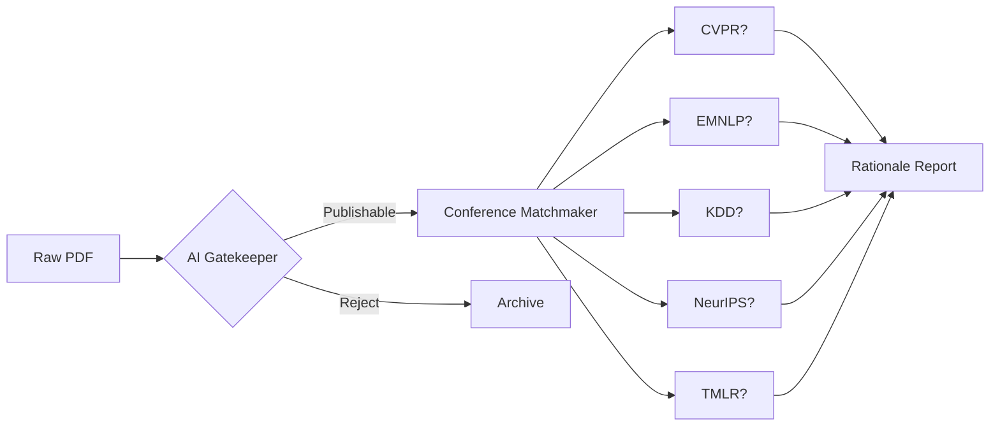

# 📄 Research Paper Classifier & Conference Matcher 🤖

**AI-powered system for academic paper evaluation and conference recommendation**

[](https://colab.research.google.com/github/yourusername/research-paper-classifier/blob/main/Paper_Classification.ipynb)

## 🌟 Key Features
- **Publishability Check**: Binary classification of papers as publishable/non-publishable
- **Conference Matching**: Recommends top conference from 5 options (CVPR, EMNLP, KDD, NeurIPS, TMLR)
- **AI-Powered Rationale**: Generates 100-word expert-style justification for conference matches
- **PDF Processing**: Automated text extraction and preprocessing from research papers
- **Semantic Analysis**: Utilizes SciBERT embeddings and FAISS similarity search

## 🛠️ Tech Stack
- **ML Models**: SciBERT, GPT-2, BART
- **NLP Tools**: Hugging Face Transformers
- **Vector Search**: FAISS
- **PDF Processing**: PyPDF2
- **Infrastructure**: Google Colab + Drive Integration

## 📂 Project Structure
   ```
   research-paper-classifier/
   ├── Paper_Classification.ipynb       # Main Colab notebook to run the pipeline
   ├── Test_Papers/                     # Folder containing test PDF research papers
   ├── reference_papers/                # Folder with 5 reference papers per conference
   ├── research_paper_classifier.pkl    # Trained publishability classifier (Logistic Regression)
   ├── tfidf_vectorizer.pkl             # TF-IDF vectorizer used during training
   ├── requirements.txt                 # List of Python dependencies
   ```


## 🌐 Digital Peer Review Pipeline



## 🚀 Quick Start
1. **Prepare Environment**:
   ```bash
   pip install -r requirements.txt

2. **Google Drive Setup**:
   - Mount Google Drive in Colab:
     ```python
     from google.colab import drive
     drive.mount('/content/drive')

    - Place test papers in:
      ```
      /content/drive/My Drive/Test_Papers
      ```
    - Upload reference papers to their respective conference folders:
      CVPR, EMNLP, KDD, NeurIPS, TMLR

3. **Run Classification:**
   ```python
   !python paper_classifier.py --input_dir /path/to/papers
   ```
4. **Get Results:**
   - The output is generated in **CSV** format with the following columns:
     `[Paper ID, Publishable, Conference, Rationale]`
   - A sample output is saved in **Google Drive** for reference.


## 🧠 How It Works

### 📄 PDF Processing:
- Text extraction and cleaning  
- Removal of references and figures  

### ✅ Publishability Check:
- TF-IDF features + pre-trained classifier  
- Binary classification decision  

### 🏷️ Conference Matching:
- SciBERT embeddings + FAISS similarity search  
- Keyword overlap analysis  
- Score aggregation  

### ✍️ Rationale Generation:
- BART summarization model  
- Context-aware justification writing  \

## 🎯 Key Components

- **Custom Vector Store**  
  FAISS-based similarity search for efficient conference matching

- **Dynamic Thresholding**  
  Adaptive logic to improve accuracy in conference prediction

- **Multi-Model Pipeline**  
  Integrates classification, embedding, and generation models for end-to-end analysis

## 📊 Sample Output

| Paper ID | Publishable | Conference | Rationale |
|----------|-------------|------------|-----------|
| R007     | 1           | CVPR       | "This paper's focus on convolutional neural networks for image segmentation aligns with CVPR's emphasis on..." |


## 🛠️ Configuration

### ➕ Add New Conferences

```python
conference_keywords["NewConf"] = ["keyword1", "keyword2"]
conference_papers["NewConf"] = ["/path/to/ref_papers"]
```

### ⚙️ Adjust Models

```python
# In notebook cells:
embedding_model = AutoModel.from_pretrained("new-model-name")
```

## 🤝 Contributing

Contributions are welcome! Please feel free to:

- Open an issue if you encounter a bug or have a suggestion.
- Submit a pull request for any improvements, bug fixes, or new features.

## 📜 License

This project is licensed under the **MIT License**.  
See the [LICENSE](LICENSE) file for details.

## 📚 Acknowledgments

- Google Research for the Colab environment  
- Hugging Face for transformer models  
- Facebook Research for FAISS

## 📞Contact

If you have any questions, suggestions, or feedback, feel free to reach out to me:

- **Email**: krishnamadhumitadutta@gmail.com 


      

